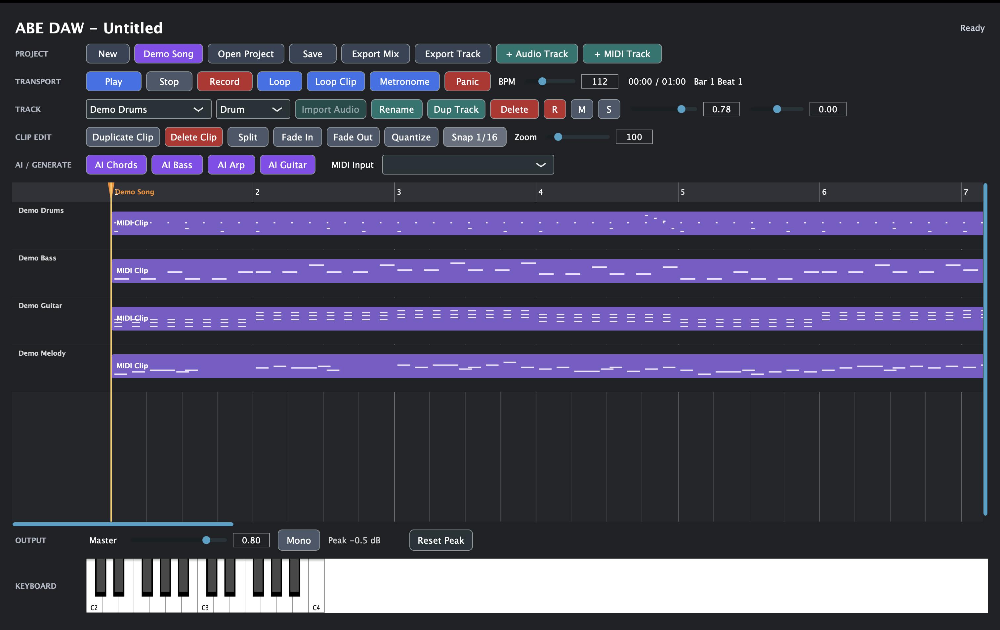

# ABE DAW

ABE DAWは、C++20、JUCE、CMakeで開発しているmacOS向けのネイティブDTMアプリです。
複数Audio/MIDIトラック、タイムライン編集、録音、簡易シンセ、Piano Roll、ローカルAI MIDI生成、WAV書き出し、プロジェクト保存を扱えます。



## できること

### プロジェクト

- 新規プロジェクト作成
- `.aidaw`プロジェクト保存 / 読み込み
- 保存時のAudio素材コピー
- Audio素材の相対パス保存
- 現在プロジェクト名のタイトル表示
- Undo / Redo
- 約1分のDemo Song生成

### トラック

- 複数Audioトラック
- 複数MIDIトラック
- トラック追加 / 削除 / 名前変更 / 複製
- トラック上下移動
- トラック選択
- Volume / Pan
- Mute / Solo
- Record Arm
- 全トラックのMute / Solo解除
- 全トラックのRecord Arm解除
- 選択トラックのStem WAV書き出し

### Audio

- WAV / AIFF / AIF / MP3読み込み
- Audioファイルのドラッグ&ドロップ読み込み
- AudioClipの波形プレビュー
- AudioClipの選択 / 移動 / トラック間移動
- AudioClipの左右端トリム
- AudioClipのSplit
- AudioClipの複製 / 削除
- AudioClipのコピー / ペースト
- AudioClipの再生位置への移動
- AudioClipのループ終端までの反復複製
- AudioClip Mute
- Clip Gain調整
- Normalize
- Reverse
- Fade In / Fade Out
- 両端クリック除去用ショートフェード
- Fade Clear
- マイク録音の基礎

### MIDI

- MIDIトラックごとのInstrument選択
  - Lead
  - Bass
  - Guitar
  - Drum
- 画面鍵盤によるMIDI発音
- PCキーボードによるMIDI発音
- 外部MIDI入力デバイス選択
- MIDI録音の基礎
- MidiClipのノートプレビュー
- MidiClipの選択 / 移動 / MIDIトラック間移動
- MidiClipの右端トリム
- MidiClipのSplit
- MidiClipの複製 / 削除
- MidiClipのコピー / ペースト
- MidiClipの再生位置への移動
- MidiClipのループ終端までの反復複製
- MidiClip Mute
- 16分クオンタイズ
- Swing Quantize
- メジャー / マイナースケール補正
- オクターブ上下移調
- 半音上下移調
- ピッチ反転
- Velocity上下調整
- Velocity Accent
- Velocity Humanize
- Timing Humanize
- Legato / Staccato
- ノート長のグリッド固定
- Double-time / Half-time

### Piano Roll

- MidiClipダブルクリックでPiano Rollを開く
- ノート追加
- ノート削除
- ノート移動
- ノート長変更
- Velocity編集

### 再生・タイムライン

- 全トラック同期再生
- 一時停止
- Stopで先頭へ戻る
- シーク
- 小節 / 拍グリッド
- 再生位置線
- BPM設定
- Tap Tempo
- Timeline Zoom
- 4分 / 8分 / 16分 / 32分グリッド切替
- スナップON/OFF
- 選択Clipのグリッド単位ナッジ移動
- 再生位置の拍 / 小節移動
- タイムラインマーカー追加 / 名前変更 / 削除 / 前後ジャンプ
- ループ再生
- 選択Clipの範囲ループ
- 現在小節 / 8小節ループ
- タイムライン上のループ範囲表示

### 音源・ミックス・書き出し

- 24ボイスの簡易シンセ
- Lead / Bass / Guitar / Drum向け簡易音色
- メトロノーム
- メトロノーム音量調整
- Master Volume
- マスターピークホールドメーター
- Monoモニター
- Panic / All Notes Off
- 全トラックのミックスWAV書き出し
- 選択トラックのStem WAV書き出し

### ローカルAI生成

外部AI APIには接続せず、ローカルルールベースでMIDIクリップを生成します。

- AI Chords
- AI Bass
- AI Arp
- AI Guitar
- AI Drums
- AI Drum Fill
- AI Melody
- Demo Song

## 画面の見方

ABE DAWの画面は上から順に機能別に分かれています。

| エリア | 役割 |
| --- | --- |
| `PROJECT` | New、Demo Song、Open、Save、Export、トラック追加 |
| `TRANSPORT` | Play、Stop、Record、Loop、BPM、Metronome、現在位置 |
| `TRACK` | 選択トラック、Instrument、Import Audio、R/M/S、Volume、Pan |
| `CLIP EDIT` | Duplicate、Delete、Split、Fade、Quantize、Snap、Zoom |
| `AI / GENERATE` | AI MIDI生成、MIDI入力デバイス |
| `Timeline` | Audio/MIDIクリップ編集、ドラッグ&ドロップ、シーク |
| `OUTPUT` | Master、Mono、Peak、Reset Peak |
| `KEYBOARD` | 画面鍵盤 |

ボタンにマウスを乗せると、各機能の説明ツールチップが表示されます。

## よく使う流れ

### 1. サンプル曲を鳴らす

1. `Demo Song`を押す
2. `Play`を押す
3. 必要なら`Master`で音量を調整する

### 2. Audioファイルを配置する

1. `+ Audio Track`を押す
2. Audioトラックを選択する
3. `Import Audio`を押す、または音声ファイルをタイムライン上のAudioトラックへドロップする
4. AudioClipをドラッグして再生位置を動かす
5. クリップ端をドラッグしてトリムする

### 3. MIDIを録音する

1. `+ MIDI Track`を押す
2. `Instrument`で音色を選ぶ
3. `R`をONにする
4. 画面鍵盤、PCキーボード、または外部MIDIキーボードで演奏する
5. `Record`を押して録音する

### 4. Piano RollでMIDIを編集する

1. MidiClipをダブルクリックする
2. 空いている場所をクリックしてノートを追加する
3. ノートをドラッグして移動する
4. ノート右端をドラッグして長さを変更する
5. ノートを右クリックして削除する
6. Velocityスライダーで強さを変更する

### 5. AI MIDIを作る

1. `+ MIDI Track`を押す
2. MIDIトラックを選択する
3. `AI Chords`、`AI Bass`、`AI Arp`、`AI Guitar`などを押す
4. 必要ならPiano Rollで編集する

### 6. 書き出す

- 全体を書き出す場合は`Export Mix`
- 選択トラックだけを書き出す場合は`Export Track`

## MIDI確認方法

- 外部MIDIキーボードを接続し、`MIDI Input`から選択する
- 画面下部の鍵盤をクリックする
- PCキーボードで演奏する
  - `A W S E D F T G Y H U J K`
  - Cから1オクターブ分の白鍵 / 黒鍵に対応

## ショートカット

### 基本

- `Space`: 再生 / 一時停止
- `Home`: 先頭へ移動
- `End`: プロジェクト末尾へ移動
- `Esc`: Panic / All Notes Off
- `Command + N`: 新規プロジェクト
- `Command + O`: プロジェクトを開く
- `Command + S`: プロジェクトを保存
- `Command + Shift + S`: 名前を付けて保存
- `Command + Z`: Undo
- `Command + Shift + Z`: Redo

### 書き出し

- `Command + Option + E`: ミックスを書き出し
- `Command + Option + Shift + E`: 選択トラックをStemとして書き出し

### トラック

- `Option + ↑ / ↓`: 前後のトラックを選択
- `Option + Shift + ↑ / ↓`: 選択中トラックを同種トラック内で上下へ移動
- `Option + R`: 選択中トラックのRecord Arm切替
- `Option + M`: 選択中トラックのMute切替
- `Option + S`: 選択中トラックのSolo切替
- `Option + Shift + R`: 選択中トラックだけをRecord Arm
- `Option + Shift + S`: 選択中トラックだけをSolo
- `Option + 0`: 選択中トラックのVolume / Panを基準値へ戻す
- `Command + Shift + A`: 全トラックのRecord Arm解除
- `Command + Shift + U`: 全トラックのMute / Solo解除
- `Command + Option + D`: 選択中トラックを複製

### クリップ共通

- `Command + C`: 選択中AudioClip / MidiClipをコピー
- `Command + V`: コピーしたClipを再生位置へペースト
- `Command + D`: 選択中Clipを複製
- `Command + Shift + D`: 選択中Clipを再生位置へ複製
- `Command + Option + Shift + D`: 選択中Clipを次の小節頭へ複製
- `Command + Option + P`: 選択中Clipを直後へ連結複製
- `Command + Option + Shift + P`: 選択中Clipをループ範囲終端まで反復複製
- `Command + Shift + M`: 選択中ClipのMute切替
- `Command + E`: 選択中Clipを再生位置でSplit
- `Command + ← / →`: 選択中Clipをグリッド単位で左右へ移動
- `Command + Shift + ← / →`: 選択中Clipの右端をグリッド単位で伸縮
- `Command + Option + ← / →`: 再生位置を選択Clipの先頭 / 末尾へ移動
- `Command + J`: 選択中Clipを再生位置へ移動
- `Tab` / `Shift + Tab`: 次 / 前のClipを選択
- `Option + C`: 再生位置に重なっているClipを選択
- `Option + Q`: 選択中Clipの開始位置を最寄りの小節頭へ揃える
- `Delete` / `Backspace`: 選択中Clipを削除

### AudioClip

- `Command + Option + F`: Fade In / Outをクリア
- `Command + Option + I / O`: Fade In / Outを0.25秒増やす
- `Command + Option + Shift + I / O`: Fade In / Outを0.25秒減らす
- `Command + Option + B`: 両端に50msフェードを設定
- `Command + = / -`: Clip Gainを上下
- `Command + 0`: Clip Gainを1.0へ戻す
- `Command + Option + Shift + 0`: ソース開始位置を0へ戻す
- `Command + Shift + N`: Normalize
- `Command + Shift + R`: Reverse切替

### MidiClip

- `Command + K`: 現在グリッドでQuantize
- `Command + Option + K`: Swing Quantize
- `Command + Shift + G`: メジャースケール補正
- `Command + Option + G`: マイナースケール補正
- `Command + ↑ / ↓`: 1オクターブ上下に移調
- `Command + Shift + ↑ / ↓`: 半音上下に移調
- `Command + Shift + I`: ピッチ反転
- `Command + Option + ↑ / ↓`: 上下オクターブを重ねる
- `Command + ] / [`：Velocityを上下
- `Command + Option + V`: Velocityを80%に統一
- `Command + Option + A`: Velocityに拍アクセント
- `Command + Shift + H`: Velocity Humanize
- `Command + Option + H`: Timing Humanize
- `Command + Shift + L`: Legato
- `Command + Option + L`: Staccato
- `Command + Option + Shift + L`: ノート長を現在グリッドへ固定
- `Command + Option + Shift + [ / ]`: Double-time / Half-time

### タイムライン

- `Option + ← / →`: 再生位置を前後の拍へ移動
- `Option + Shift + ← / →`: 再生位置を前後の小節へ移動
- `Option + F`: プロジェクト全体が見えるようにZoom
- `Option + T`: Tap Tempo
- `Option + [ / ]`: スナップグリッド切替
- `Option + B`: 現在小節をループ範囲に設定
- `Option + Shift + L`: 現在位置から8小節をループ範囲に設定
- `Option + Shift + B`: ループ範囲を解除

### マーカー

- `Option + M`: 現在位置にマーカーを追加
- `Command + Option + M`: 選択中Clipの先頭にマーカーを追加
- `Option + Shift + M`: 再生位置付近のマーカー名を変更
- `Option + Delete` / `Option + Backspace`: 再生位置付近のマーカーを削除
- `Option + , / .`: 前後のマーカーへ移動

### AI生成

- `Command + Option + U`: AI Drums
- `Command + Option + Shift + U`: AI Drum Fill
- `Command + Option + Shift + T`: AI Guitar
- `Command + Option + Y`: AI Melody
- `Command + Option + Shift + Y`: Demo Song

### ミックス

- `Option + = / -`: メトロノーム音量を上下
- `Option + Shift + 0`: Master Volumeを基準値へ戻す

## ビルド

### 必要環境

- macOS
- Apple Silicon Mac
- Xcode Command Line Tools
- CMake 3.22以上
- Git

### 取得

JUCEはGit Submoduleとして管理しています。

```bash
git clone --recursive git@github.com:Masa-eba/AI-DAW.git
cd AI-DAW
```

`--recursive`なしでクローンした場合:

```bash
git submodule update --init --recursive
```

### ビルド

```bash
cmake -S . -B build
cmake --build build
```

### 起動

```bash
open build/MiniDAW_artefacts/ABE\ DAW.app
```

## macOS権限

マイク録音にはmacOSのマイク権限が必要です。権限確認が表示された場合は許可してください。

## プロジェクト保存

`.aidaw`保存時、AudioClipが参照している音声素材はプロジェクトファイルと同じ階層の`Audio/`フォルダへコピーされます。
プロジェクトJSON内には`Audio/filename.wav`のような相対パスを保存するため、プロジェクトフォルダ単位で移動できます。

## ディレクトリ構成

```text
AI-DAW/
├── CMakeLists.txt
├── README.md
├── JUCE/
└── Source/
    ├── Main.cpp
    ├── MainComponent.h
    ├── MainComponent.cpp
    ├── AudioEngine.h
    ├── AudioEngine.cpp
    ├── Audio/
    │   ├── AudioClip.h
    │   ├── AudioRecorder.h
    │   ├── AudioRecorder.cpp
    │   ├── AudioTrack.h
    │   ├── AudioTrack.cpp
    │   ├── Metronome.h
    │   └── Metronome.cpp
    ├── Core/
    │   ├── ProjectModel.h
    │   ├── ProjectModel.cpp
    │   ├── TempoMap.h
    │   ├── TempoMap.cpp
    │   └── TrackTypes.h
    ├── Midi/
    │   ├── MidiClip.h
    │   ├── MidiInputManager.h
    │   ├── MidiInputManager.cpp
    │   ├── MidiTrack.h
    │   ├── MidiTrack.cpp
    │   ├── SimpleSynth.h
    │   └── SimpleSynth.cpp
    ├── UI/
    │   ├── PianoRollComponent.h
    │   ├── PianoRollComponent.cpp
    │   ├── TimelineComponent.h
    │   └── TimelineComponent.cpp
    └── Utils/
        ├── TimeFormatter.h
        └── TimeFormatter.cpp
```

## 主要クラス

- `MainComponent`
  - 画面レイアウト、FileChooser、UIイベント接続
- `AudioEngine`
  - オーディオ/MIDI再生、録音、ミックス、書き出し
- `ProjectModel`
  - BPM、トラック、クリップ、マーカー、プロジェクト保存
- `AudioTrack`
  - AudioClip、音量、Pan、Mute、Solo、Record Arm
- `MidiTrack`
  - MidiClip、Instrument、音量、Pan、Mute、Solo、Record Arm
- `TimelineComponent`
  - タイムライン描画、クリップ移動、トリム、ファイルドロップ
- `PianoRollComponent`
  - MIDIノート追加、削除、移動、長さ変更、Velocity編集
- `SimpleSynth`
  - Lead / Bass / Guitar / Drum簡易音源
- `Metronome`
  - BPM同期クリック生成
- `AudioRecorder`
  - ThreadedWriterによるマイク録音

## 現在の制限

- Piano Rollは基礎編集のみで、複数選択編集やMIDI CC編集は未実装
- Audioタイムストレッチは未実装
- VST / AUプラグインには未対応
- AI生成はローカルの簡易MIDI生成で、外部AI APIは未接続
- 内蔵音色は簡易シンセによる近似で、サンプル音源や物理モデリングではない
- Audioファイルは現在メモリへ読み込むため、長時間ファイルには不向き
- マイク録音とMIDI録音は基礎実装で、同時録音や詳細編集は今後の対象

## 今後の予定

- Piano Rollの複数選択編集
- MIDI CC編集
- AudioClipの高度編集
- 複数クリップ一括編集
- エフェクト
- Audio-to-MIDI
- AIコード提案
- AI伴奏生成
